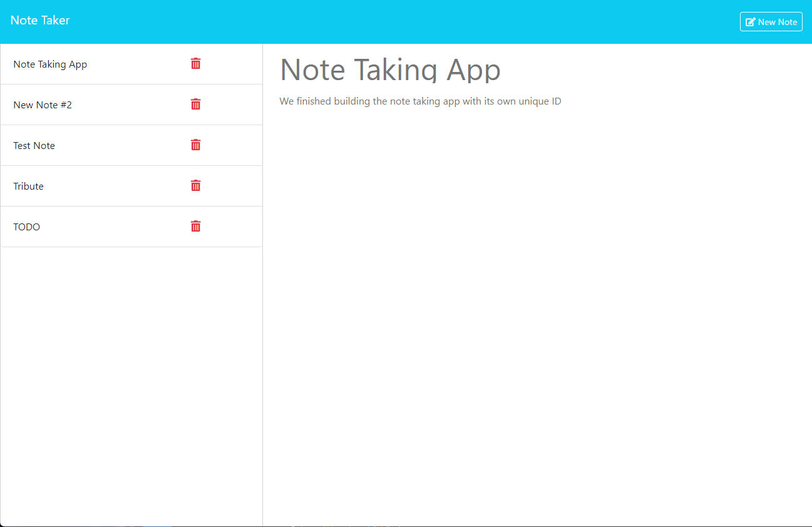

  
  # Note Taker

  

  ## Description

  This is a simple note taking app designed to use in a browser showcasing basic Express functionality. Notes are stored locally to be accessible after closing/refreshing the browser. A delete button function will be added in the near future for added utility

  ## Table of Contents

  - [Installation](#installation)
  - [Usage](#usage)
  - [Credits](#credits)
  - [License](#license)

  ## Installation

  No installation required.

  ## Usage

   Navigate to the website, enter a note title, the note you would like to save, then hit "save note."

   - [Walkthrough video of application in action](https://drive.google.com/file/d/1UDEe7Tvfdyu_A9x96ZiWgKXqPWJFlM9j/view?usp=sharing)
  - Note: you may have to change quality to higher setting for better viewing experience

  
  
  ## Credits 

  My wife for having patience with me while I take this bootcamp course

  ## License

  MIT License 

  Click the badge for further information

  

  ## Questions
  
  For any further questions, please contact davesalter1988@gmail.com, and visit https://github.com/DaveSalterM for addition projects
